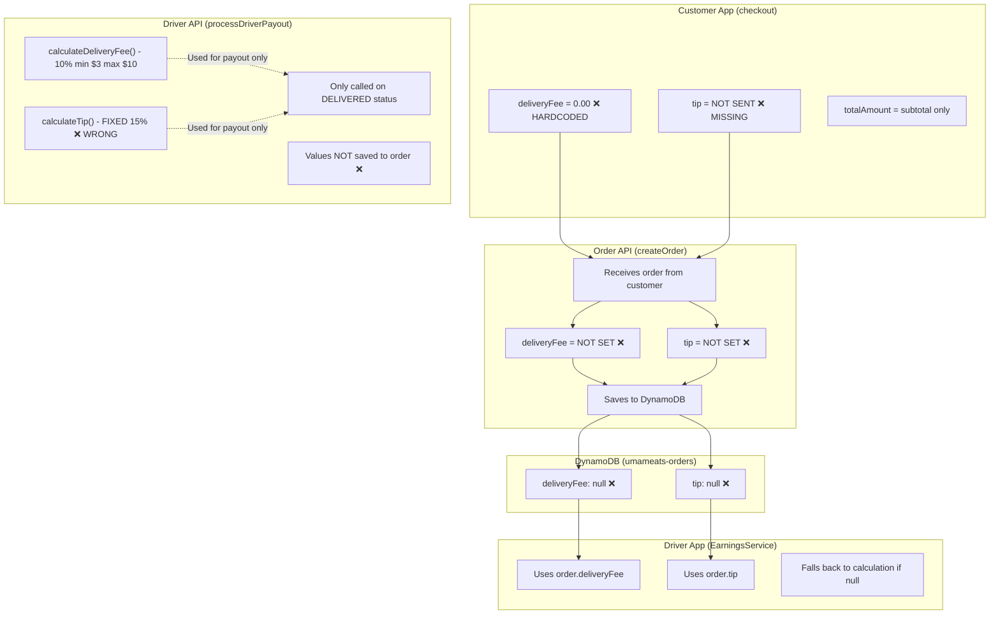
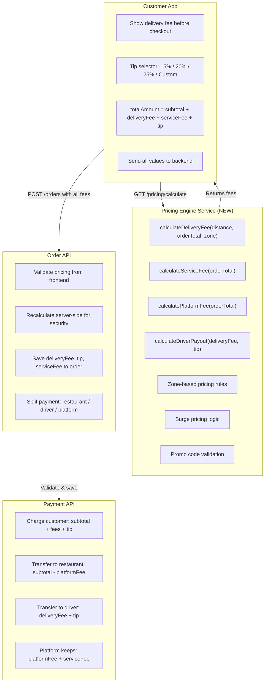

# UMAMEATS Pricing Engine Design

## Overview

This document describes the pricing engine architecture for UMAMEATS, responsible for calculating delivery fees, tips, service fees, and platform fees.

## Current State (Problems)



### Problems Identified

| Component | What It Does | Problem |
|-----------|--------------|---------|
| **Customer App** (`checkout/page.tsx` line 146) | `deliveryFee = 0.00` hardcoded | Never sends real delivery fee |
| **Customer App** | No tip field in checkout | Customer can't tip |
| **Order API** (`createOrder`) | Just saves what it receives | Doesn't calculate or set deliveryFee/tip |
| **Driver API** (`processDriverPayout`) | Calculates fee/tip for payout only | Values NOT saved to order |
| **Driver App** (`EarningsService`) | Reads from order, falls back | Always falls back because order has null |

## Target Architecture



## Pricing Rules

### Delivery Fee Calculation

```
Base Fee: $2.99
Distance Fee: $0.50 per km (after first 2km free)
Minimum: $2.99
Maximum: $9.99

Formula:
deliveryFee = max($2.99, min($9.99, $2.99 + max(0, distance - 2) * $0.50))
```

### Service Fee

```
Service Fee: 5% of subtotal
Minimum: $0.99
Maximum: $4.99

Formula:
serviceFee = max($0.99, min($4.99, subtotal * 0.05))
```

### Platform Fee (from Restaurant)

```
Platform Fee: 15% of subtotal (taken from restaurant payout)
```

### Tip

```
Customer selects: 15%, 18%, 20%, 25%, or custom amount
Tip goes 100% to driver
```

## Order Fields

| Field | Type | Description |
|-------|------|-------------|
| `subtotal` | Long (cents) | Sum of item prices |
| `deliveryFee` | Long (cents) | Calculated delivery fee |
| `serviceFee` | Long (cents) | Platform service fee |
| `tip` | Long (cents) | Customer tip for driver |
| `totalAmount` | Long (cents) | subtotal + deliveryFee + serviceFee + tip |
| `platformFee` | Long (cents) | 15% of subtotal (for accounting) |

## Payment Split

When order is paid:

1. **Customer pays**: `totalAmount` (subtotal + deliveryFee + serviceFee + tip)
2. **Restaurant receives**: `subtotal - platformFee` (85% of food cost)
3. **Driver receives**: `deliveryFee + tip` (on delivery completion)
4. **Platform keeps**: `platformFee + serviceFee`

## Implementation Checklist

- [x] Document current state and problems
- [ ] Create PricingService in order-api
- [ ] Update Order model with new fields
- [ ] Update createOrder to calculate and persist fees
- [ ] Add tip selector UI to customer-app
- [ ] Add delivery fee display to customer-app
- [ ] Update driver-api to use persisted values
- [ ] Test end-to-end flow

## Date Created

2026-01-11

